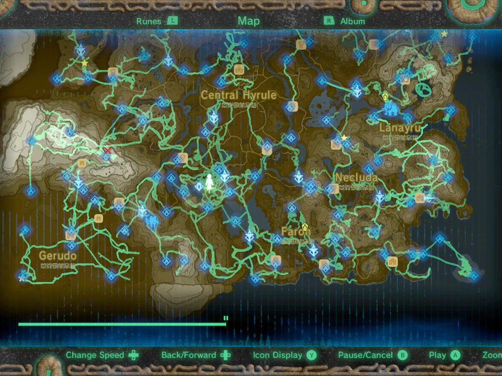
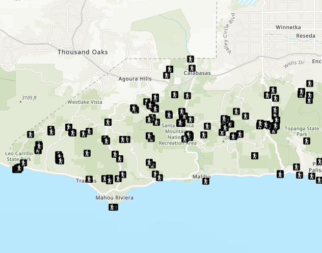

<!-- Twitter icon from https://github.com/carlsednaoui/gitsocial -->
[1.1]: http://i.imgur.com/tXSoThF.png (twitter icon with padding)

# _Style a Feature Layer_

#### ArcGIS Practice

 _An map app using HTML, JavaScript, and ArcGIS  6.6.18_

#### By **Dawn Mott** :sunrise_over_mountains:

  

This is not my map, this is a map of Hyrule
 

  

This is my map, this is part of California

### Description
_ArcGIS practice_

### Setup/Installation Requirements

_Clone or download this project. Does not require a server or setting up a database._

### Known Bugs

_There are many known :bug: at this time, this is a work in progress_

### Support and contact details

_Happily awaiting a chat,_ @dawnrparty _on_ ![alt text][1.1]

### Technologies Used

_HTML, JavaScript, ArcGIS_

### License

*MIT License*

Copyright (c) 2018 **_Dawn Mott_**
